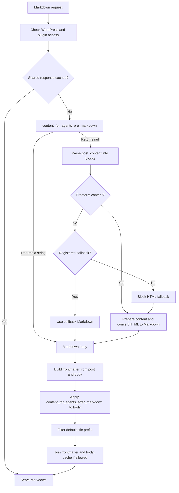
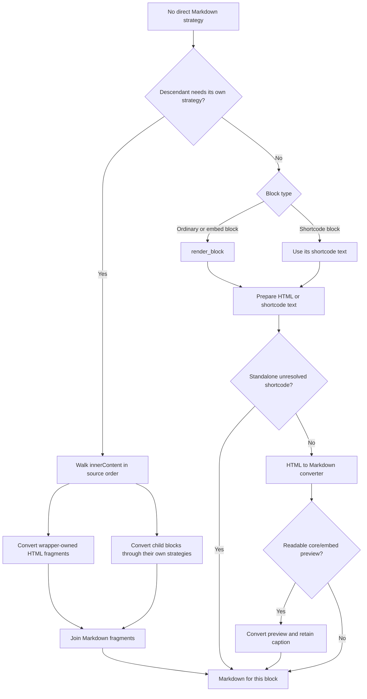

# Conversion architecture

Content for Agents starts with a WordPress post and produces a Markdown body.
The endpoint then adds frontmatter and response headers. This page explains
where block callbacks and HTML conversion fit in that flow. For public hooks
and callback registration, see the [plugin guide](PLUGIN-GUIDE.md).

## Choosing a path for each block

`Markdown_Converter` parses the stored `post_content` with `parse_blocks()`.
It processes each block in order:

1. Freeform or Classic Editor content has no block name. It goes through the
   HTML conversion path. Block-level callbacks do not run for it.
2. A callback in `Block_Markdown_Registry` receives the parsed block and post.
   Its return value is Markdown, including an empty string that suppresses the
   block. This path runs the `content_for_agents_block_{block-name}` filter.
3. Otherwise, the block takes the HTML fallback described below.

If a wrapper contains a descendant with its own Markdown strategy, the
converter walks its `innerContent` fragments and child blocks in source order.
This lets a child callback run without losing HTML owned by the wrapper.
The converter joins the resulting Markdown fragments after each path completes.
Callback output is not sent through HTML conversion.

## How the HTML fallback handles blocks

For an ordinary block, `render_block()` produces the HTML that WordPress would
render, including output from a dynamic block's render callback. The plugin
then converts that HTML. A `core/shortcode` block starts with its shortcode
text instead; registered shortcodes run during HTML preparation. If an
unregistered shortcode has a recognizable URL, it becomes a link. Otherwise
it remains literal. For `core/embed`, the plugin can use WordPress's readable
embed preview and retain its caption; when there is no readable preview, the
original URL remains available.

The descendant path avoids rendering a wrapper as one HTML string when a child
needs a Markdown callback. `innerContent` contains the wrapper's HTML fragments
and placeholders for its children. The converter processes those in order:
wrapper fragments take the HTML path, while child blocks take their own
callback or fallback path. `core/quote` reapplies quote markers to
the combined result; `core/list` keeps native list markers and nesting.
The plugin does not run `the_content` over the whole post.

## The HTML conversion path

Before converting HTML, the plugin runs registered shortcodes and WordPress
typography and smiley filters. An unregistered shortcode with a recognizable
URL becomes a link; otherwise its text remains. `HTML_To_Markdown_Converter`
then walks WordPress HTML API tokens. `Markdown_Inline_Buffer` collects text and
inline format boundaries before choosing Markdown syntax. `Markdown_Output_Writer`
assembles paragraphs, quotes, and lists after their children are complete. The
converter handles code and table cells. If the tree-aware HTML Processor stops
at unsupported markup, the converter retries with the Tag Processor so later
content is retained.

The block writer follows the deferred block model in
[html-to-md](https://github.com/dmsnell/html-to-md), while keeping prose
unwrapped. The converter targets CommonMark with GFM tables and strikethrough.
It uses inline HTML where Markdown cannot preserve the source structure, such
as breaks inside headings or inline code.

## Assembling the response

`content_for_agents_pre_markdown` can replace the entire body before block
parsing. `Frontmatter` is built from the post and converted body, then
`content_for_agents_after_markdown` can alter the served body. `Markdown_Response`
passes the default post-title H1 to `content_for_agents_markdown_prefix` after
converting the body, places the result before that body, and caches the response
only when shared caching is allowed.

Direct calls to `post_to_markdown()` return the body. They do not build
frontmatter or run `content_for_agents_after_markdown`.
